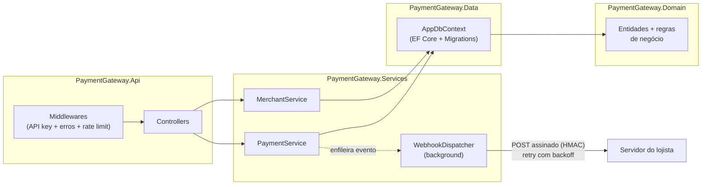

# 💳 Payment Gateway API


API de gateway de pagamentos construída em **C# / .NET 10**, simulando o núcleo de um sistema de adquirência: autorização, captura, cancelamento e estorno de transações com cartão, contabilidade de partidas dobradas, idempotência e webhooks assinados com HMAC.

> Projeto de portfólio com foco no domínio de **meios de pagamento** — o ciclo de vida completo de uma transação, do "passou o cartão" ao repasse (menos a taxa) para o lojista.

## Funcionalidades

**Domínio de pagamentos**
- **Ciclo de vida da transação** — `Authorized → Captured → Refunded` (ou `Voided` antes da captura, `Declined` na recusa), com as transições de estado protegidas dentro da própria entidade de domínio.
- **Ledger de partidas dobradas** — nenhum saldo é um campo mutável no banco; tudo é derivado de lançamentos contábeis imutáveis. Em toda captura, débitos = créditos (valor bruto = repasse ao lojista + taxa do gateway).
- **Idempotência** — o header `Idempotency-Key` garante que uma retentativa de rede não cobre o cliente duas vezes, com proteção contra corrida via índice único no banco.
- **Validação de cartão** — algoritmo de Luhn, detecção de bandeira (incluindo Elo e Hipercard) e checagem de validade.
- **Consciência de PCI DSS** — número completo do cartão e CVV **nunca** são persistidos; apenas bandeira e últimos 4 dígitos.

**Segurança e confiabilidade**
- **Autenticação por API key** — cada lojista recebe uma chave `pk_...` exibida uma única vez; apenas o hash SHA-256 é armazenado.
- **Webhooks assinados (HMAC-SHA256)** — cada notificação leva o header `X-Webhook-Signature`; o lojista valida a autenticidade com o segredo `whsec_...` recebido no cadastro. Entrega em background com retentativas e backoff exponencial.
- **Rate limiting** — 100 requisições/minuto por API key (particionado: um lojista abusivo não afeta os demais), com resposta `429` padronizada.
- **Health check real** — `/health` consulta o banco, pronto para load balancers e orquestradores.

**Engenharia**
- **Migrations do EF Core** — o schema do banco é versionado junto com o código.
- **Logging estruturado com Serilog** — eventos pesquisáveis por propriedade, não texto solto.
- **44 testes**: 36 unitários + 8 de integração com `WebApplicationFactory` (a API inteira exercitada via HTTP, incluindo middlewares e rate limiter).
- **Warnings = erros** (`Directory.Build.props`): código com aviso não compila.
- **Docker** multi-stage + docker-compose.
- **CI no GitHub Actions** — build e testes a cada push.

## Arquitetura



Camadas em dependência linear — `Api → Services → Data → Domain` — cada uma conhece apenas a de baixo. O domínio é C# puro, sem dependência de framework.

## Como rodar

### Com o .NET SDK

Pré-requisito: [.NET SDK 10](https://dotnet.microsoft.com/download)

```bash
dotnet run --project src/PaymentGateway.Api
```

### Com Docker

```bash
docker compose up --build
```

A API sobe em `http://localhost:8080` (SDK: `http://localhost:5223`).

Acesse **/swagger**. Em desenvolvimento, um lojista demo já vem criado com a API key:

```
pk_test_demo_1234567890abcdef
```

Clique em **Authorize** no Swagger e cole a chave — ou use o arquivo [PaymentGateway.Api.http](src/PaymentGateway.Api/PaymentGateway.Api.http), que contém o fluxo completo pronto para executar no VS Code (extensão REST Client) ou no Visual Studio.

### Rodar os testes

```bash
dotnet test
```

### Criar uma nova migration

```bash
dotnet tool restore
dotnet dotnet-ef migrations add NomeDaMigration --project src/PaymentGateway.Data --startup-project src/PaymentGateway.Api
```

## Endpoints

| Método | Rota | Descrição | Auth |
|--------|------|-----------|:----:|
| POST | `/api/v1/merchants` | Cadastra lojista, gera API key e segredo de webhook | — |
| GET | `/api/v1/merchants/me` | Dados do lojista autenticado | 🔑 |
| GET | `/api/v1/merchants/me/balance` | Saldo calculado a partir do ledger | 🔑 |
| POST | `/api/v1/payments` | Autoriza um pagamento (aceita `Idempotency-Key`) | 🔑 |
| GET | `/api/v1/payments` | Lista com paginação e filtro por status | 🔑 |
| GET | `/api/v1/payments/{id}` | Consulta um pagamento | 🔑 |
| POST | `/api/v1/payments/{id}/capture` | Captura (confirma a cobrança) | 🔑 |
| POST | `/api/v1/payments/{id}/void` | Cancela autorização não capturada | 🔑 |
| POST | `/api/v1/payments/{id}/refund` | Estorna pagamento capturado | 🔑 |
| GET | `/api/v1/payments/{id}/events` | Trilha de eventos / status dos webhooks | 🔑 |

## Cartões de teste

| Número | Resultado |
|--------|-----------|
| `4242 4242 4242 4242` | ✅ Aprovado (Visa) |
| `5555 5555 5555 4444` | ✅ Aprovado (Mastercard) |
| `4000 0000 0000 0002` | ❌ Recusado — `card_declined` |
| `4000 0000 0000 9995` | ❌ Recusado — `insufficient_funds` |
| `4000 0000 0000 9987` | ❌ Recusado — `lost_card` |

Qualquer número que falhe no algoritmo de Luhn é rejeitado com **HTTP 422** antes mesmo de chegar ao "emissor".

## Validando a assinatura do webhook

Cada notificação enviada ao lojista inclui o header `X-Webhook-Signature`. Para validar:

```csharp
// secret = o "whsec_..." recebido no cadastro
var hash = HMACSHA256.HashData(
    Encoding.UTF8.GetBytes(secret),
    Encoding.UTF8.GetBytes(corpoDaRequisicao));

var esperado = "sha256=" + Convert.ToHexStringLower(hash);
var valido = CryptographicOperations.FixedTimeEquals(
    Encoding.UTF8.GetBytes(esperado),
    Encoding.UTF8.GetBytes(headerRecebido));
```

Se a assinatura bater, a notificação veio mesmo do gateway e não foi adulterada — mesmo mecanismo usado por Stripe e GitHub.

## Decisões técnicas

| Decisão | Motivo |
|---------|--------|
| Valores monetários em **centavos (inteiro)** | Elimina erros de arredondamento de ponto flutuante; mesmo padrão da Stripe |
| Saldo **derivado do ledger**, nunca armazenado | Auditabilidade total: cada centavo tem origem rastreável; impossível o saldo "desincronizar" |
| Transições de estado **dentro da entidade** `Payment` | Nenhum serviço consegue, por engano, estornar algo não capturado — a regra mora num lugar só |
| API key com **hash SHA-256** no banco | Se o banco vazar, as chaves não vazam junto (mesmo princípio de senha) |
| Idempotência com **índice único** no banco | Funciona mesmo com requisições concorrentes — a constraint decide o vencedor |
| Webhooks via **Channel + BackgroundService** | A API responde rápido; a entrega (lenta e falível) acontece em background com retry |
| **Migrations** aplicadas na inicialização | Adequado a instância única; com réplicas, o passo migraria para o pipeline de deploy |
| Rate limiting **particionado por API key** | Limite justo por cliente, não global |
| SQLite | Zero configuração para rodar o projeto; em produção seria PostgreSQL (a troca é uma linha no `UseSqlite` + nova migration) |

## Possíveis evoluções

- Captura e estorno **parciais**
- PostgreSQL + testes com Testcontainers
- Relatório de conciliação diária (batch)
- Outbox pattern para garantir entrega de webhooks após restart
- Observabilidade com OpenTelemetry

## Licença

[MIT](LICENSE) — © 2026 Neemias Silva
